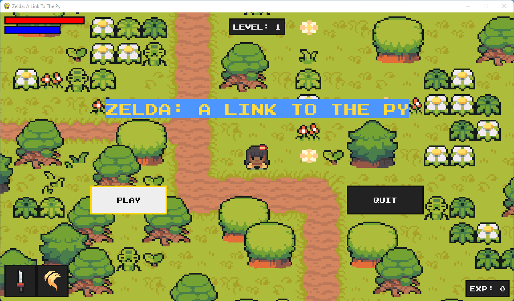
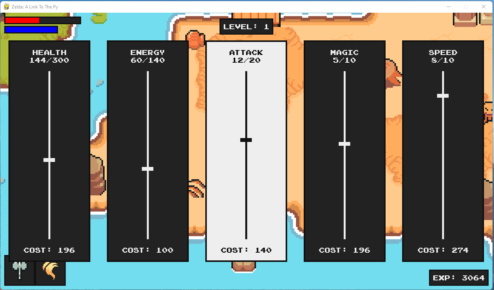
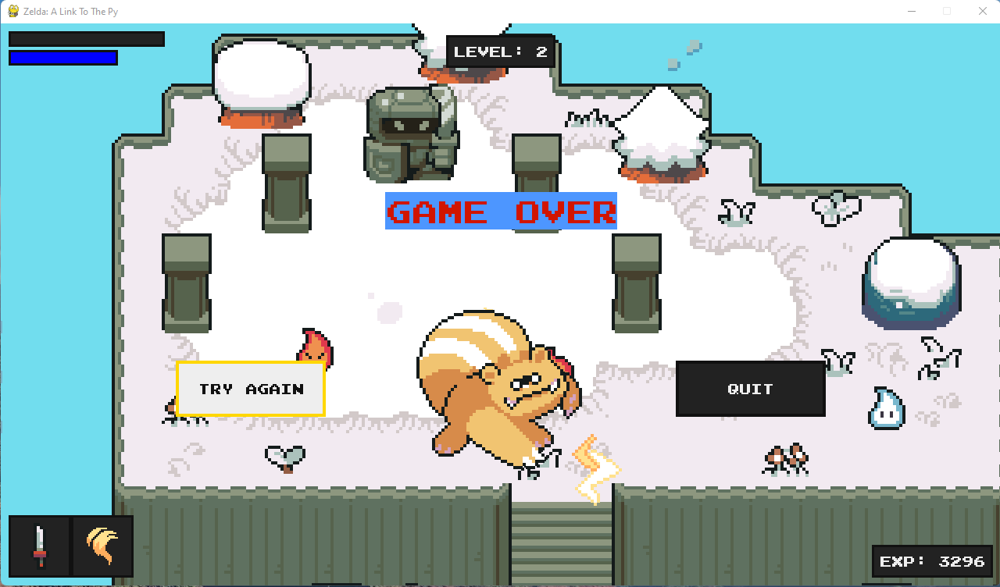
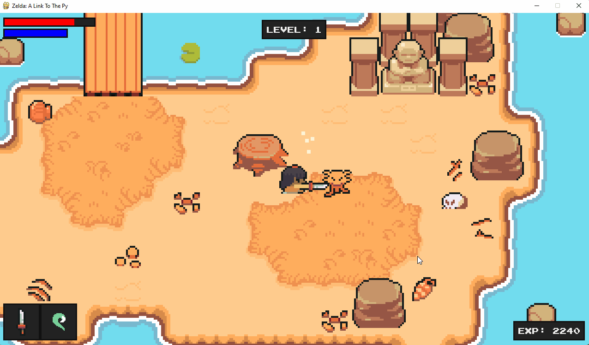
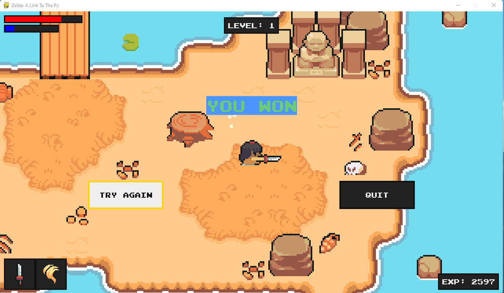

# Zelda Style RPG in pygame

* 2D Zelda Style RPG developed using pygame and tile graphics.
* Game was developed as part of the following [Clear Code Youtube Tutorial](https://www.youtube.com/watch?v=QU1pPzEGrqw&list=PLGUFtX0WQvIfc_tREtSfYcQpDju0YMg93&index=6&t=2678s&ab_channel=ClearCode). 

</img>

## About 

The code mostly follows the tutorial, however I did put my own flavour on it, such as:
  * Refactored methods to reduce code complexity, and follow clean code principles.
  * Refactored code structure, modulizing for a more organsied development.

Sections I implemmented not in the tutorial:
  * TitleMenuInterfaceBase, base class for title screen inheritance. the TitleScreenInterface, LevelCompleteInterface and GameOverInterface inherit this class.
  * Title Screen Menu:
    * Option to 'Play' or 'Quit' 
  * Leveling: 
    * Can set number of levels in settings.py. Enemy sprites will respawn and become increasing harder but reward more experience points.
    * Level Complete Interface: Option to 'Continue' or 'Quit' 
  * Game Over Menu:
    * Display 'Game Over' or 'You Won' deppending on the outcome
    * Options to 'Try Again' or 'Quit'

## Running The Game
* The entry point to the game is main.py in the src folder.
  * To run the game have src as your current working directory as the asset imports are relative.
  * Keyboard controls are stored in the settings module located in src/utils/settings.py. Update them if you like. 
  * The rest of the code is organsied into sub modules, for better organsation and grouping of like functions and objects. 
* All the game assets (audio, graphics, game layout files) are in the assets folder.
  * The names of sub folders in assets are used as keys for animations and audio. For example, graphics/monsters/spirit/idle coresponds to the name dictionary key of the monstor and its idle status. 

## Game Play Overview

### Title Screen
</img>

### Upgrade Menu
</img>

### Game Over 
</img>

### Level Complete
</img>

### Game Complete - You Win
</img>

# References
  * [YouTube Tutorial](https://www.youtube.com/watch?v=QU1pPzEGrqw&list=PLGUFtX0WQvIfc_tREtSfYcQpDju0YMg93&index=6&t=2678s&ab_channel=ClearCode)
  * [Starting Files](https://github.com/clear-code-projects/Zelda)
  * [Art assets and the soundtrack - Pixel-boy and AAA](https://pixel-boy.itch.io/ninja-adventure-asset-pack)